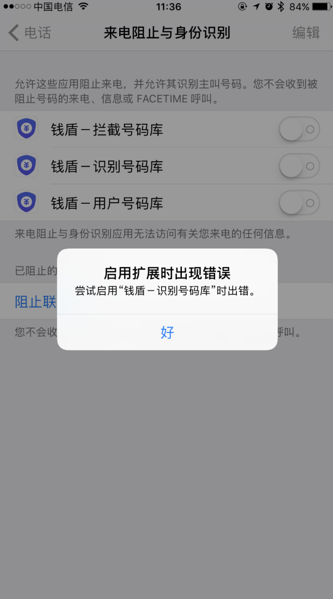
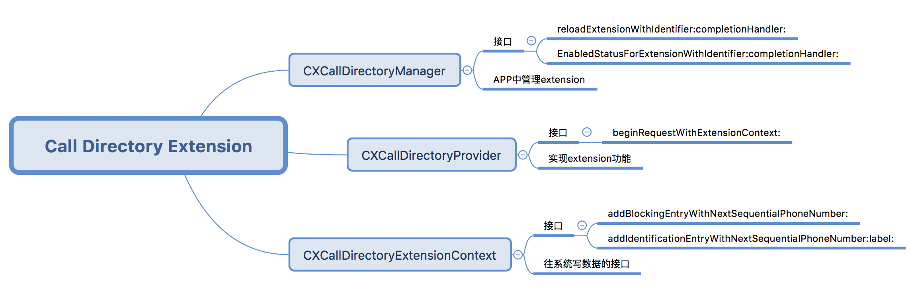
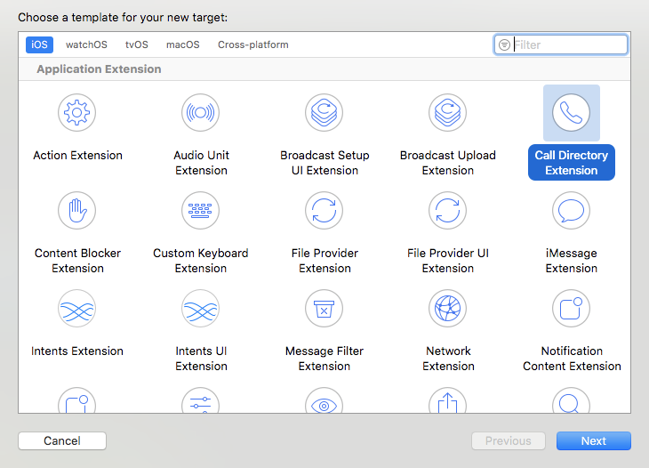
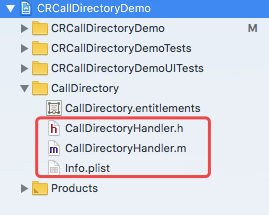
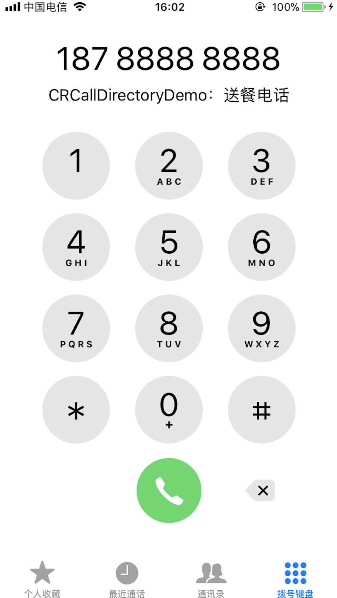

# iOS用CallKit实现来电识别、来电拦截

---

> 博客：http://www.jianshu.com/p/a27dbdc9b4d5

## 前言

> 最近需要实现一个新需求，用iOS 10出的CallKit实现将APP的通讯录的信息同步到系统中，可以不把人员信息加到通讯录中，实现来电号码识别。这个功能在xx安全卫士、xx管家中很早就实现了，但是网上相关的资料较少，而且官方的文档写的太简单了，很多坑还要自己去摸索。于是记录一下和各位分享，如有错误之处请各位指出！

PS: 先说个题外话吧，CallKit功能在iOS 10的时候还不太稳定，iOS 10刚出来的时候为了体验骚扰拦截功能，手贱装了两个不同的拦截APP，然后就悲剧了。盗一张网上的图：

然后各种重启、重装APP都没有用，写的Demo也跑不起来，唯一的办法只有重置系统。说多了都是泪！


## 一、Call Directory app extension

实现来电识别、来电拦截功能需要使用CallKit当中的`Call Directory app extension`，首先，需要了解extension。关于extension网上有很多教程，这里就不细说了。推荐两篇文章，英文好的推荐看[官方文档](https://developer.apple.com/library/content/documentation/General/Conceptual/ExtensibilityPG/index.html)，还有一篇[中文博客](http://foggry.com/blog/2014/06/23/wwdc2014zhi-app-extensionsxue-xi-bi-ji/)。

使用Call Directory Extension主要需要和3个类打交道，分别是
`CXCallDirectoryProvider`、`CXCallDirectoryExtensionContext`、`CXCallDirectoryManager`。




### CXCallDirectoryProvider
> 官方文档：The principal object for a Call Directory app extension for a host app.

正如官方文档所说，这是Call Directory app extension最重要的一个类。
用系统模板新建Call Directory Extension之后会自动生成一个类，继承自`CXCallDirectoryProvider`。入口方法：
```objectivec
// 有两种情况改方法会被调用
// 1.第一次打开设置-电话-来电阻止与身份识别开关时，系统自动调用
// 2.调用CXCallDirectoryManager的reloadExtensionWithIdentifier方法会调用
- (void)beginRequestWithExtensionContext:(CXCallDirectoryExtensionContext *)context {
    context.delegate = self;
    // 添加号码识别信息与号码拦截列表
    [self addIdentificationPhoneNumbersToContext:context];
    [context completeRequestWithCompletionHandler:nil];
}
```

### CXCallDirectoryExtensionContext
> 官方文档：A programmatic interface for adding identification and blocking entries to a Call Directory app extension.
> CXCallDirectoryExtensionContext objects are not initialized directly, but are instead passed as arguments to the CXCallDirectoryProvider instance method beginRequestWithExtensionContext:.

大致意思就是说，这是一个为Call Directory app extension添加号码识别、号码拦截的入口。`CXCallDirectoryExtensionContext`不需要自己初始化，它会作为`CXCallDirectoryProvider`的`beginRequestWithExtensionContext`函数的参数传递给使用者。
它的主要方法有两个：

```objectivec
// 设置号码识别信息
- (void)addIdentificationEntryWithNextSequentialPhoneNumber:(CXCallDirectoryPhoneNumber)phoneNumber label:(NSString *)label;

// 设置号码拦截列表
- (void)addBlockingEntryWithNextSequentialPhoneNumber:(CXCallDirectoryPhoneNumber)phoneNumber;
```
> 在设置时候要注意：
> 1. 号码不能重复，不然会报错`CXErrorCodeCallDirectoryManagerErrorDuplicateEntries`
> 2. 号码必须按照升序写入，不然会报错`CXErrorCodeCallDirectoryManagerErrorEntriesOutOfOrder`
> 3. 号码必须格式化后传入，手机号码必须加上国家码，例如18012341234就不行，需要加上86，构造成8618012341234；固话需要格式为：国家码+区号（去掉第一个0）+号码，例如010-61001234格式化之后为，861061001234。如果号码格式错误，会导致识别不出来。
> 4. 上限数据是200万（在其它文章里看到的，然后自己测试了下，构造了200万条数据写入的时候会报错`CXErrorCodeCallDirectoryManagerErrorMaximumEntriesExceeded`，150万条数据是OK的，所以这个数据上限一定要注意。实测安装了XX安全卫士、XX管家实现骚扰电话拦截用了3个extension，可能数据量太大就是一个原因。）
> 5. 在用户第一次打开设置时，会调用`beginRequestWithExtensionContext`，这时候不宜写太多数据，不然会卡在设置那里转圈，用户体验很差。可以先写部分数据，然后回到主APP了调用`reloadExtensionWithIdentifier`去刷新。

### CXCallDirectoryManager
> 官方文档：The programmatic interface to an object that manages a Call Directory app extension.

`CXCallDirectoryManager`主要作用是管理Call Directory app extension。
有两个方法：

```objectivec
// 重新设置号码识别、电话拦截列表
// 调用该方法后会重置之前设置的列表，然后调用beginRequestWithExtensionContext:
- (void)reloadExtensionWithIdentifier:(NSString *)identifier completionHandler:(nullable void (^)(NSError *_Nullable error))completion;

// 获取extension是否可用，需要在“设置-电话-来电阻止与身份识别"中开启权限
- (void)getEnabledStatusForExtensionWithIdentifier:(NSString *)identifier completionHandler:(void (^)(CXCallDirectoryEnabledStatus enabledStatus, NSError *_Nullable error))completion;
```

## 二、实战

> 先上[Demo地址](https://github.com/crmo/CRCallDirectoryDemo)。下面会一步步讲解。

### 创建extension
新建一个Target（File-New-Target）。


会自动建立一个目录，默认有三个文件。在.m文件中有系统给出的示例代码


我们来看看系统的模板代码，首先是入口函数

```objectivec
- (void)beginRequestWithExtensionContext:(CXCallDirectoryExtensionContext *)context {
    context.delegate = self;
    if (context.isIncremental) {
        [self addOrRemoveIncrementalBlockingPhoneNumbersToContext:context];

        [self addOrRemoveIncrementalIdentificationPhoneNumbersToContext:context];
    } else {
        [self addAllBlockingPhoneNumbersToContext:context];

        [self addAllIdentificationPhoneNumbersToContext:context];
    }
    
    [context completeRequestWithCompletionHandler:nil];
}
```

### CallDirectoryHandler

我在Xcode 9生成的代码，`context.isIncremental`是iOS 11才增加的，还有所有的remove的方法也是iOS 11才有的，为了适配iOS 10，还是不推荐使用。
系统模板代码大致逻辑就是，先添加号码识别、号码拦截记录，添加完成后调用`completeRequestWithCompletionHandler:`完成整个过程。
由于号码拦截比较简单，只是写入一个号码的数组，本文就以号码识别为例，号码识别方法系统模板这么写的：
```objectivec
- (void)addAllIdentificationPhoneNumbersToContext:(CXCallDirectoryExtensionContext *)context {
    CXCallDirectoryPhoneNumber allPhoneNumbers[] = { 8618788888888, 8618885555555 };
    NSArray<NSString *> *labels = @[ @"送餐电话", @"诈骗电话" ];
    NSUInteger count = (sizeof(allPhoneNumbers) / sizeof(CXCallDirectoryPhoneNumber));
    for (NSUInteger i = 0; i < count; i += 1) {
        CXCallDirectoryPhoneNumber phoneNumber = allPhoneNumbers[i];
        NSString *label = labels[i];
        [context addIdentificationEntryWithNextSequentialPhoneNumber:phoneNumber label:label];
    }
}
```
这么多代码，核心就是一行`[context addIdentificationEntryWithNextSequentialPhoneNumber:phoneNumber label:label];`,注意phoneNumber是`CXCallDirectoryPhoneNumber`类型，其实就是`long long`类型。
在这个函数里，需要把需要识别的号码和识别信息，一条一条的写入

### 检查授权

开启extension功能需要在“设置-电话-来电阻止与身份识别”中开启，我们在写入数据时第一步是引导用户给我们的extension授权。
```objectivec
    CXCallDirectoryManager *manager = [CXCallDirectoryManager sharedInstance];
    [manage
     getEnabledStatusForExtensionWithIdentifier:self.externsionIdentifier
     completionHandler:^(CXCallDirectoryEnabledStatus enabledStatus, NSError * _Nullable error) {
         // 根据error，enabledStatus判断授权情况
		 // error == nil && enabledStatus == CXCallDirectoryEnabledStatusEnabled 说明可用
		 // error 见 CXErrorCodeCallDirectoryManagerError
		 // enabledStatus 见 CXCallDirectoryEnabledStatus
     }];
```

### 写入数据

用户在设置开启后，调用`reloadExtensionWithIdentifier`即可触发`CallDirectoryHandler`更新数据逻辑。

```objectivec
    CXCallDirectoryManager *manager = [CXCallDirectoryManager sharedInstance];
    [manager reloadExtensionWithIdentifier:self.externsionIdentifier completionHandler:^(NSError * _Nullable error) {
        // error 见 CXErrorCodeCallDirectoryManagerError
    }];
```

### 验证

接下来在真机下跑下（一定要在插了电话卡的iPhone上调试，模拟器不行！），写入成功后，打开电话，拨号18788888888，提示”送餐电话”。说明写入成功！



## 三、extension和containing app数据共享

上面的步骤中，号码信息是写死在代码中的，在实际应用中这些号码信息肯定不是写死的，一般需要从服务器获取。这就需要我们的APP与extension进行通信，需要用到APP Groups，怎么用网上有很多文章了，我就不多说了，[推荐一篇](http://foggry.com/blog/2014/06/23/wwdc2014zhi-app-extensionsxue-xi-bi-ji/)。
其实本质就是通过`APP Groups`，开辟一片空间，extension和containing app都可以访问，然后我们的APP就可以通过NSUserDefaults、文件、数据库等方式共享数据给extension了。前期我使用过NSUserDefaults，效率很低，大概在5万数据的时候就爆内存了，使用extension一定要注意内存，不然很容易被系统干掉，所以不推荐使用这种方式。
Demo中采用的是读写文件的方式，大致思路（`具体实现看Demo`）：
1. 在APP中把数据序列化之后写到一个文件中
2. 在extension中读取这个文件，读取一行，调用一次`addIdentificationEntryWithNextSequentialPhoneNumber`，然后及时释放
这种方式理论上是可以达到最大限制200w条的（实际测试150万没有问题）。


### 获取APP Groups文件路径

```objectivec
NSFileManager *fileManager = [NSFileManager defaultManager];
    NSURL *containerURL = [[NSFileManager defaultManager] containerURLForSecurityApplicationGroupIdentifier:self.groupIdentifier];
    containerURL = [containerURL URLByAppendingPathComponent:@"CallDirectoryData"];
    NSString* filePath = containerURL.path;
```

### 进度监控

在xx安全卫士中，开启骚扰电话拦截功能有一个进度条，非常的直观。但是在extension中是没法更新UI的，有一种实现方式，可以用开源框架[MMWormhole](https://github.com/mutualmobile/MMWormhole)来实现APP与extension通信，然后把进度从extension传到APP中，在APP中更新进度条。理论上该方案是可行的，感兴趣的同学可以尝试下。

---

* 参考链接
https://developer.apple.com/documentation/callkit
https://developer.apple.com/videos/play/wwdc2016/230/
https://colin1994.github.io/2016/06/17/Call-Directory-Extension-Study/
https://yunissong.github.io/2017/03/29/CallKit/
http://www.jianshu.com/p/7f88cbe7948c
https://www.raywenderlich.com/150015/callkit-tutorial-ios


